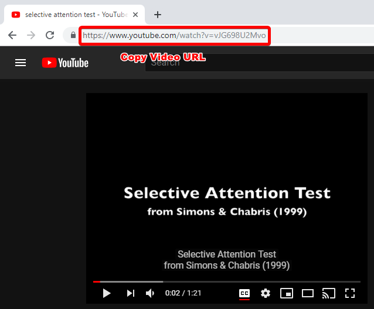
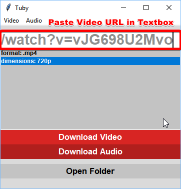
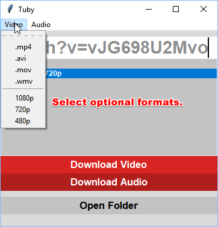
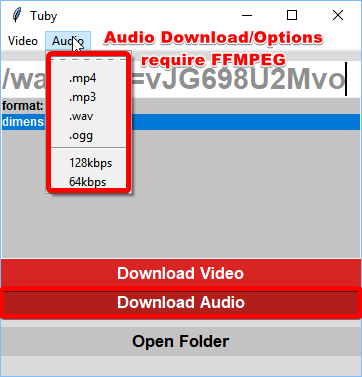
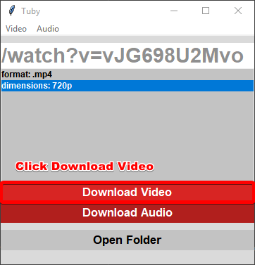

# This project currently is on hold until one of the dependencies (pytube) is able to fix fatal errors! Really sorry :(

# Tuby
An open source, lightweight YouTube video downloader!

### The compiled application can be found here!
https://github.com/Robswc/Tuby/blob/master/dist/tuby.exe

## How to Use

### 1. Copy the URL of the video you wish to download.

### 2. Paste the copied URL into the textbox within Tuby.

### 3. Select optional formats. Default is .mp4, 720p, the most optimized format for general use.

### 4. For audio FFMPEG must be installed here: C:/Program Files/FFMPEG/ffmpeg.exe

### 5. Click Download Video!

Your downloaded videos will appear in a folder named "downloads" located within the same directory that tuby was launched from.  This allows content creators to quickly download videos into project specific directories.  This allows one to easily download multiple videos into one folder, without having to move them later!

### Please report any issues you have!
